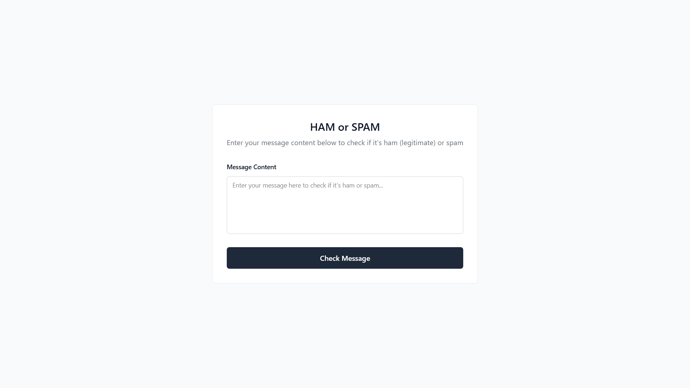

# Spam or Ham Classifier

This project is a simple web application that classifies user-submitted messages as either **spam** or **ham** (not spam). It uses a Naive Bayes classifier trained on a sample dataset and is built using **FastAPI** for the backend and **TailwindCSS** for the frontend.

## Table of Contents

- [Introduction](#introduction)
- [Features](#features)
- [Tech Stack](#tech-stack)
- [How to Run](#how-to-run)
- [Screenshots](#screenshots)
- [Live Demo](#live-demo)
- [Contributing](#contributing)
- [License](#license)

## Introduction

This application allows users to enter a message and determine whether it is spam or ham (legitimate). It uses a basic statistical model (Naive Bayes) trained on a sample dataset to make predictions. The goal is to demonstrate a simple spam detection mechanism through an interactive and minimal web interface.

## Features

- Classify text as **spam** or **ham**
- Naive Bayes algorithm for classification
- Simple and clean UI built with TailwindCSS
- FastAPI backend for high-performance request handling

## Tech Stack

- **Frontend**: HTML, TailwindCSS
- **Backend**: Python, FastAPI
- **Machine Learning**: Naive Bayes
- **Dataset**: Sample spam/ham dataset (e.g., SMS Spam Collection)

## How to Run

Follow these steps to run the project locally:

1. Clone the repository:

   ```bash
   git clone https://github.com/sansalgo/ham-or-spam.git
   cd ham-or-spam
   ```

2. Create a virtual environment and activate it:

   ```bash
   python -m venv env
   source env/bin/activate  # On Windows use: env\Scripts\activate
   ```

3. Install dependencies:

   ```bash
   pip install -r requirements.txt
   ```

4. Start the FastAPI server:

   ```bash
   fastapi dev app.py
   ```

5. Open your browser and navigate to:

   ```
   http://localhost:8000
   ```

## Screenshots



## Live Demo

Check out the live demo here: [Spam or Ham Live](https://ham-or-spam.onrender.com/)

## Contributing

Contributions are welcome! Feel free to open issues or submit pull requests to improve the project.

## License

This project is licensed under the MIT License - see the [LICENSE](LICENSE) file for details.
